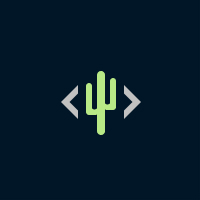

  

<h3 align="center">Code for Tucson Project Templates</h3>

   
  
  
  

---

 Template Repository for Code for Tucson holding GitHub templates, assets for websites, and everything needed to start a new CFT project from scratch.
      

## 📝 Table of Contents
- [About](#about)
- [Usage](#usage)
- [TODO](./TODO.md)
- [Contributing](./CONTRIBUTING.md)
- [Authors](#authors)
- [Acknowledgments](#acknowledgement)

## About 
Template Repository for Code for Tucson holding GitHub templates, assets for websites (favicon, logos), and general basics needed to start a new CFT project from scratch.

## Usage 

To use the templates you can either `git clone` this project, [fork](https://github.com/khar3jee/cft_templates/fork) it on GitHub or click on the [Use this template](https://github.com/khar3jee/cft_templates/generate) button up top.

### How to find a project
- Join our [Meetup](https://www.meetup.com/Code-for-Tucson/) and [Slack](https://codefortucson.slack.com/)
- Take a look at our [Code for Tucson Website](https://www.codefortucson.com/)
- Explore our [existing projects](https://github.com/orgs/CodeForTucson/projects) or start your own!

## Contributing
Please see our [Code of Conduct](https://www.codefortucson.com/code-of-conduct/), and [CONTRIBUTING.md](CONTRIBUTING.md) for how to you can contribute.

## ✍️ Authors 
- [@khar3jee](https://github.com/khar3jee) - initial modifications
- Original templates and work by [@kylelobo](https://github.com/kylelobo) from their [The Documentation Compendium](https://github.com/kylelobo/The-Documentation-Compendium/) 
- Code for Tucson logo by [Jennifer Cozzette](http://thenounproject.com/term/cactus/29212/)

See also the list of [contributors](https://github.com/kylelobo/The-Documentation-Compendium/contributors) who participated in the Documentation Compendium project.

